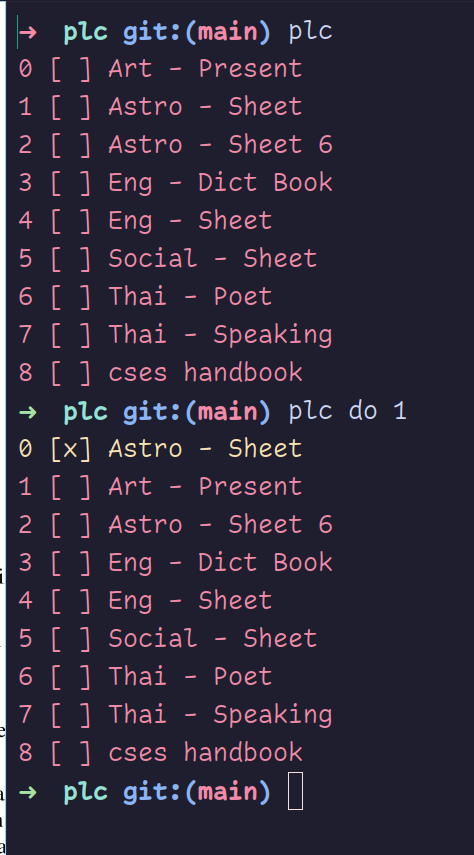

### plc is a cli task manager

inspired by [please](https://github.com/NayamAmarshe/please)
which i find take a bit too long to open
so i made a more minimal version in C

### installation/ building

    sudo make install

or to staticly compile with musl

    CC='musl-gcc -static -Os' make

### notes

- plc is WIP, it may have bugs

- before using, create ~/.config/plc.txt or ~/plc.txt depending on your XDG variables, because i am too lazy to implement `creating the file if not exists` feature

### usage

show all tasks

    plc

add task

    plc add <taskname>
    plc add task name, with space will be joined automatically

delete task

    plc del <task index>
    plc del <1> <2> <3> ...

mask task as done/ undone

    plc do <task index>
    plc do <1> <2> <3> ...

sort all tasks

    plc sort

clean all done task

    plc clean

### but you wrote [ttask](https://github.com/sleepntsheep/ttask) 

yes, but it's ncurses based which is slow to use, just using argv for input is simpler and a lot faster

and also ttask is written in python 🤮
